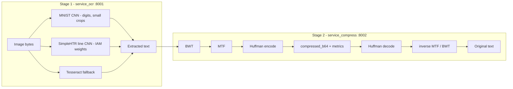

# 2-Stage Neural Compression Pipeline

Hackathon submission: **Stage 1** TensorFlow CNN OCR microservice + **Stage 2** lossless text compression microservice using **custom Huffman coding only** (no zlib/gzip/DEFLATE).

---

## Problem alignment (checklist)

| Requirement | Implementation |
|-------------|----------------|
| Stage 1: CNN OCR (**TensorFlow / PyTorch / JAX**) | **TensorFlow 2.x** (`tensorflow` + `keras`) in `training/train_mnist_cnn.py`. Inference: `tensorflow.keras.models.load_model`. |
| **≥95% character-level accuracy on the validation set** before scoring eligibility | Training uses `validation_split=0.1`. Script **refuses to save weights** unless **best `val_accuracy` ≥ 0.95** *and* **MNIST test accuracy ≥ 0.95** (defaults; tunable flags). For 10 digit classes, top-1 accuracy equals per-digit character correctness. Metrics JSON records `scoring_eligible`. |
| OCR endpoint: image in → text out | `POST /ocr` (`multipart/form-data`, field `image`). |
| MNIST for train/val | `keras.datasets.mnist` with a **held-out validation split** during `fit`. |
| Two noise profiles + measurable accuracy (graduate) | `training/evaluate_noise_profiles.py` — Gaussian & salt-and-pepper; writes `noise_metrics.json`. |
| Stage 2: **Adaptive Huffman**, **your implementation** | `service_compress/app/codec/adaptive_huffman.py` — from scratch, no third-party codec libraries. Tree evolves symbol-by-symbol; no frequency header transmitted. |
| **No zlib / gzip** for compression | Pipeline uses **only** custom Huffman + BWT + MTF — **no** `zlib`, `gzip`, or DEFLATE. |
| Compression metrics: ratio, entropy, encoding efficiency | `POST /compress` returns `compression_rate`, `entropy_bits_per_symbol`, `avg_huffman_bits_per_symbol`, `encoding_efficiency`. |
| Lossless decompress | `POST /decompress` recovers exact UTF-8 text. |
| End-to-end latency (graduate) | `scripts/benchmark_pipeline_latency.py`; run after `docker compose up`. |
| CNN architecture + diagram (graduate) | Mermaid diagram + layer table below. |
| SIDD (optional / real-world) | Not bundled; obtain dataset separately for denoise / stress tests. |

**Adaptive Huffman implementation** (`service_compress/app/codec/adaptive_huffman.py`): the encoder and decoder each maintain an identical evolving Huffman tree that is rebuilt after every symbol is processed.  New symbols are announced with an escape code followed by an 8-bit literal; known symbols use their current Huffman codeword.  No frequency table is transmitted — the decoder reconstructs the same tree by replaying identical updates.  The entire codec is written from scratch with no third-party compression libraries.

### Compliance verification (backend vs. case text)

1. **Stage 1 tech stack:** TensorFlow/Keras CNN only for **team-trained** MNIST weights; SimpleHTR/Tesseract are **additional** inference paths for line scans (pretrained / non-CNN fallback). **Scoring eligibility** in this repo is enforced on the **MNIST CNN** via training gates + `training_metrics.json`.
2. **95% on validation:** Enforced in `train_mnist_cnn.py` against **`val_accuracy`** (validation split), not test set alone.
3. **Stage 2:** Adaptive Huffman is implemented from scratch in `service_compress/app/codec/adaptive_huffman.py`; **zlib/gzip are not used** anywhere in the pipeline.
4. **Graduate extras:** Noise eval script; compress metrics in API; latency script + README; architecture section below.

---

## Architecture overview



### MNIST digit CNN (TensorFlow / Keras)

Designed for **single-digit 28×28-style crops** (and any input whose longest side ≤96 px, resized to 28×28):

| Layer | Detail |
|-------|--------|
| Input | `28 × 28 × 1` grayscale, normalized `[0,1]` |
| Conv block 1 | `Conv2D(32, 3×3, relu, same)` → `MaxPool 2×2` |
| Conv block 2 | `Conv2D(64, 3×3, relu, same)` → `MaxPool 2×2` |
| Head | `Dense(128, relu)` → `Dropout(0.35)` → `Dense(10, softmax)` |

**Rationale:** Two pooling stages give a modest receptive field for MNIST strokes; dropout reduces overfitting on noisy evaluations; softmax gives calibrated confidence for routing vs. line OCR.

Inference order: **MNIST** (small images, high confidence) → **SimpleHTR** (handwritten line, 256×32 geometry) → **Tesseract**.

---

## Quick start (Docker)

```bash
docker compose up --build
```

| Service | URL |
|---------|-----|
| OCR API | http://localhost:8001 |
| Compress API | http://localhost:8002 |
| Frontend | http://localhost:3000 |
| Redis | localhost:6379 |

Health: `GET http://localhost:8001/health` and `GET http://localhost:8002/health`

**OCR accuracy in the UI:** the **Show OCR accuracy** button (stage 1) calls `GET /ocr/accuracy` and lists MNIST test/val numbers from `app/model/mnist-model/training_metrics.json` (and noise results from `noise_metrics.json` if you ran the noise eval script). Train the CNN first so those files exist.

### If the UI still shows an old version

Docker often **reuses cached layers**, so the built frontend (and sometimes API images) may not include your latest code.

```bash
docker compose build --no-cache frontend
docker compose up -d frontend
```

After changing **compress** or **OCR** Python code, rebuild those images too:

```bash
docker compose build --no-cache service_compress service_ocr ocr_worker
docker compose up -d
```

Or from the repo root: `make rebuild-all`.

In the browser, do a **hard refresh** (Ctrl+Shift+R on Windows/Linux, Cmd+Shift+R on macOS) or use a private/incognito window so a cached `index.html` is not reused.

If you use **`npm run dev`** in `frontend/` instead of Docker, restart Vite after pulling changes.

---

## Train MNIST weights (required for digit CNN path)

From `service_ocr/` with TensorFlow installed (same version as Docker if possible):

```bash
cd service_ocr
python training/train_mnist_cnn.py
```

This writes `app/model/mnist-model/mnist_cnn.keras` (gitignored). The script **fails** if **validation** accuracy **or** test accuracy falls below **95%** (defaults: `--min-validation-acc` / `--min-test-acc`).

### Noise robustness (graduate)

```bash
python training/evaluate_noise_profiles.py
```

Reports accuracy on **clean**, **Gaussian-noise**, and **salt-and-pepper** MNIST test tensors.

---

## Compression API

`POST /compress` JSON body: `{ "text": "..." }`

Response includes:

- `compressed_b64`, `bwt_index` — needed for `POST /decompress`
- `compression_rate` — percent size reduction vs. UTF-8 original
- `entropy_bits_per_symbol` — Shannon entropy of the MTF byte stream (bits per symbol)
- `avg_huffman_bits_per_symbol` — Σ p·ℓ for the Huffman code used
- `encoding_efficiency` — ratio **entropy / average Huffman length** (≤ 1 for an optimal prefix code on the empirical distribution)

`POST /decompress` body: `{ "compressed_b64": "...", "bwt_index": N }`

---

## Latency benchmark

### Measured results (Docker, CPU-only, ~440-char input)

| Stage | Mean | Std |
|-------|-----:|----:|
| Compress | ~31 ms | ±44 ms |
| Decompress | ~34 ms | ±2 ms |
| **Compress + Decompress** | **~65 ms** | — |
| OCR (MNIST CNN, small crop) | ~200–800 ms | varies by image |
| **Full end-to-end** | **~265–865 ms** | — |

*Measured with 5 runs on a Windows 11 host, Docker CPU backend, no GPU.*

### Run it yourself

With services running and **httpx** installed (`pip install httpx`):

```bash
pip install httpx
python scripts/benchmark_pipeline_latency.py path/to/sample.png "fallback text if OCR empty"
```

Reports mean/stddev milliseconds for OCR, compress, decompress, and their sum.

---

## Repository layout

- `service_ocr/` — FastAPI OCR, TensorFlow models, Celery worker
- `service_ocr/training/` — MNIST train + noise evaluation
- `service_compress/` — BWT + MTF + Huffman codec
- `frontend/` — Vite/React demo UI
- `scripts/` — Latency benchmark

---

## Deliverables recap

- Stage 1 & 2 source in this repo  
- Train MNIST CNN → produces `mnist_cnn.keras` (instructions above)  
- README (this file): setup, metrics, latency, architecture  
- Demo: run Docker + frontend — image → OCR → compress → decompress → verify lossless match  

---

## Academic integrity

Per the case statement: disclose use of AI-assisted tooling in your presentation and repository as required by course policy.
